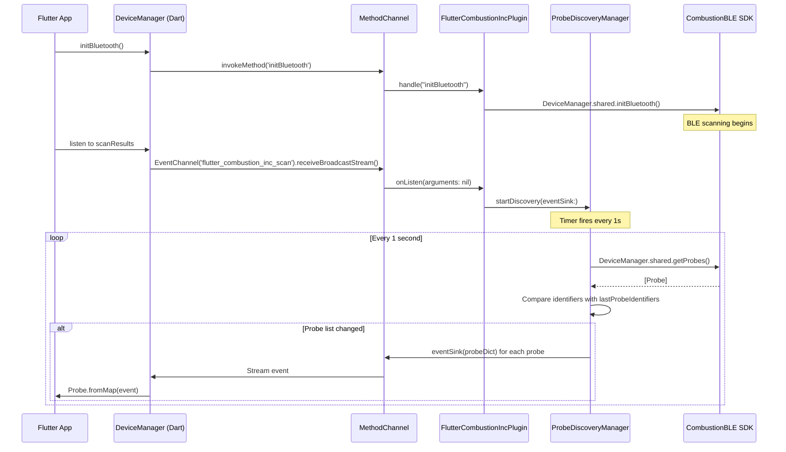
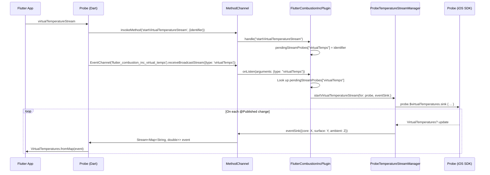
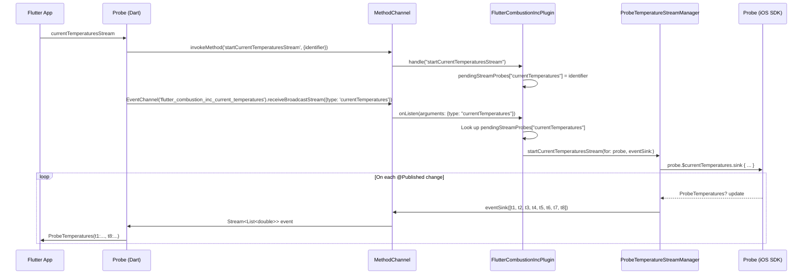

# Flutter Plugin vs iOS SDK — Gap Analysis Report

> **Scope**: Comparison of `flutter_combustion_inc` (Flutter plugin) against `combustion-ios-ble` (iOS BLE SDK reference architecture).
>
> **Purpose**: Identify architectural differences, missing capabilities, and produce prioritized alignment recommendations.
>
> **Android**: Out of scope — this analysis focuses on the iOS/macOS native bridge.

---

## Section 1: Flutter Plugin Current Architecture

### 1.1 Architecture Overview

The Flutter plugin follows a three-layer architecture:

```
┌─────────────────────────────────────────────────────────────────────┐
│ Dart Layer (lib/)                                                   │
│                                                                     │
│  ┌──────────────────┐    ┌────────────────────────────────────┐     │
│  │  DeviceManager    │───►│  FlutterCombustionIncPlatform      │     │
│  │  (singleton)      │    │  (abstract platform interface)     │     │
│  └──────────────────┘    └──────────────┬─────────────────────┘     │
│                                         │                           │
│  ┌──────────────────┐    ┌──────────────▼─────────────────────┐     │
│  │  Probe            │    │  MethodChannelFlutterCombustionInc │     │
│  │  (device model)   │───►│  (concrete implementation)         │     │
│  └──────────────────┘    └────────────────────────────────────┘     │
│                                                                     │
│  Models: ProbeTemperatures, VirtualTemperatures, BatteryStatus,     │
│          PredictionInfo, PredictionMode/State/Type,                  │
│          ProbeLogDataPoint, ProbeTemperatureLog                      │
└─────────────────────────────────────────────────────────────────────┘
                              │ MethodChannel + EventChannels
┌─────────────────────────────▼───────────────────────────────────────┐
│ Native iOS Bridge (ios/Classes/)                                    │
│                                                                     │
│  ┌──────────────────────────────────────────────────────────────┐   │
│  │  FlutterCombustionIncPlugin                                   │   │
│  │  (method routing + stream handler coordination)               │   │
│  └──────────┬───────────────────────────────────────────────────┘   │
│             │                                                       │
│  ┌──────────▼──────────┐  ┌─────────────────────────────────────┐   │
│  │ProbeDiscoveryManager│  │ProbeTemperatureStreamManager        │   │
│  │(polling + change    │  │(virtual temps + raw sensor streams) │   │
│  │ detection)          │  └─────────────────────────────────────┘   │
│  └─────────────────────┘                                            │
│  ┌─────────────────────┐  ┌─────────────────────────────────────┐   │
│  │ProbeConnectionMgr   │  │ProbeStatusStreamManager             │   │
│  │(connect/disconnect) │  │(battery + staleness streams)        │   │
│  └─────────────────────┘  └─────────────────────────────────────┘   │
│  ┌─────────────────────┐  ┌─────────────────────────────────────┐   │
│  │ProbeSessionManager  │  │ProbePredictionManager               │   │
│  │(session info + logs)│  │(target temp + prediction streams)   │   │
│  └─────────────────────┘  └─────────────────────────────────────┘   │
└─────────────────────────────────────────────────────────────────────┘
                              │ Direct API calls
┌─────────────────────────────▼───────────────────────────────────────┐
│ iOS SDK (CombustionBLE)                                             │
│                                                                     │
│  DeviceManager.shared                                               │
│    ├── devices: [String: Device]                                    │
│    ├── getProbes() → [Probe]                                        │
│    ├── setRemovalPrediction(...)                                     │
│    └── initBluetooth()                                              │
│                                                                     │
│  Probe (ObservableObject with @Published properties)                │
│    ├── $virtualTemperatures, $currentTemperatures                   │
│    ├── $batteryStatus, $statusNotificationsStale                    │
│    ├── $sessionInformation, $percentOfLogsSynced                    │
│    ├── $predictionInfo                                              │
│    └── connect() / disconnect()                                     │
│                                                                     │
│  (MeatNet, ConnectionManager, BleManager exist but are NOT          │
│   surfaced through the Flutter bridge)                              │
└─────────────────────────────────────────────────────────────────────┘
```

### 1.2 Dart Model Classes

#### `DeviceManager` (singleton)

| Member | Type | Description |
|--------|------|-------------|
| `instance` | `static final DeviceManager` | Singleton accessor |
| `scanResults` | `Stream<Probe>` | Stream of discovered probes via `flutter_combustion_inc_scan` EventChannel |
| `initBluetooth()` | `Future<void>` | Initializes BLE and starts scanning |
| `getProbes()` | `Future<List<Probe>>` | Snapshot of currently known probes |
| `setTargetTemperature(identifier, tempC)` | `Future<void>` | Sets target temp for predictions |
| `predictionStream(identifier)` | `Stream<PredictionInfo>` | Prediction updates for a probe |

#### `Probe`

| Property | Type | Description |
|----------|------|-------------|
| `identifier` | `String` | UUID on iOS (BLE peripheral identifier) |
| `serialNumber` | `String` | Probe serial number |
| `name` | `String` | User-visible name |
| `macAddress` | `String` | MAC address |
| `id` | `int` | Numeric ID (1–8) |
| `color` | `int` | Silicone ring color |

| Method/Stream | Return Type | Description |
|---------------|-------------|-------------|
| `connect()` | `Future<void>` | Connect and maintain connection |
| `disconnect()` | `Future<void>` | Disconnect from probe |
| `rssi` | `Future<int>` | Current RSSI value |
| `statusStaleStream` | `Stream<bool>` | Data staleness indicator |
| `virtualTemperatures` | `Future<VirtualTemperatures>` | One-shot virtual temps |
| `virtualTemperatureStream` | `Stream<VirtualTemperatures>` | Continuous virtual temps |
| `batteryStatus` | `Future<BatteryStatus>` | One-shot battery status |
| `batteryStatusStream` | `Stream<BatteryStatus>` | Continuous battery status |
| `currentTemperatures` | `Future<ProbeTemperatures>` | One-shot raw 8-sensor temps |
| `currentTemperaturesStream` | `Stream<ProbeTemperatures>` | Continuous raw 8-sensor temps |
| `logSyncPercentageStream` | `Stream<double>` | Log sync progress (0–100) |
| `temperatureLog` | `Future<ProbeTemperatureLog>` | Temperature log with data stream |
| `sessionInfoStream` | `Stream<Map<String, dynamic>>` | Session availability + sample period |
| `sessionInfo` | `Future<Map<String, dynamic>>` | One-shot session info |
| `predictionStream` | `Stream<PredictionInfo>` | Prediction updates |

#### `ProbeTemperatures`

Eight individual sensor readings (t1–t8) as `double` values in Celsius. Convenience getter `tip` → `t1`.

#### `VirtualTemperatures`

| Property | Type | Description |
|----------|------|-------------|
| `core` | `double` | Estimated core temperature |
| `surface` | `double` | Estimated surface temperature |
| `ambient` | `double` | Ambient temperature |

Factory constructor `fromMap(Map<String, dynamic>)` for platform channel deserialization.

#### `BatteryStatus` (enum)

Values: `ok`, `low`. Includes `fromInt(int)` factory.

#### `PredictionInfo` (immutable)

| Property | Type | Description |
|----------|------|-------------|
| `estimatedTimeSeconds` | `int?` | Seconds until target temp reached |
| `targetTemperatureCelsius` | `double` | Configured target temperature |
| `currentCoreTempCelsius` | `double?` | Current virtual core temp |
| `estimatedCoreTemperature` | `double` | SDK's estimated core temp for prediction |
| `percentThroughCook` | `int` | Cooking progress 0–100 |
| `predictionState` | `PredictionState` | Current prediction system state |
| `predictionMode` | `PredictionMode` | Prediction mode configuration |
| `predictionType` | `PredictionType` | Current prediction type |
| `isReliable` | `bool` | Whether prediction is reliable |
| `timestamp` | `DateTime` | When prediction was generated |

Factory constructor `fromMap(Map<String, dynamic>)` with dual parsing (raw int preferred, string fallback).

#### `PredictionMode` (enum)

Values: `none`, `timeToRemoval`, `removalAndResting`, `reserved`. Includes `fromInt` and `fromString` factories.

#### `PredictionState` (enum)

Values: `probeNotInserted`, `probeInserted`, `cooking`, `predicting`, `removalPredictionDone`, `reservedState5`–`reservedState14`, `unknown`. Includes `fromInt` and `fromString` factories.

#### `PredictionType` (enum)

Values: `none`, `removal`, `resting`, `reserved`. Includes `fromInt` and `fromString` factories.

#### `ProbeLogDataPoint`

| Property | Type | Description |
|----------|------|-------------|
| `sequence` | `int` | Sequential index in the log |
| `temperatures` | `ProbeTemperatures` | 8-sensor readings at this point |

Factory constructor `fromMap(Map<String, dynamic>)`.

#### `ProbeTemperatureLog`

| Property | Type | Description |
|----------|------|-------------|
| `dataStream` | `Stream<ProbeLogDataPoint>` | Stream of individual log data points |
| `startTime` | `DateTime?` | Session start time |

Constructed from a raw stream of batched maps, expanded and mapped to `ProbeLogDataPoint`.

### 1.3 Platform Interface API

`FlutterCombustionIncPlatform` is the abstract contract. All methods are overridden by `MethodChannelFlutterCombustionInc`.

| Method Signature | Category |
|------------------|----------|
| `initBluetooth()` → `Future<void>` | Initialization |
| `probeListStream()` → `Stream<List<Map<String, dynamic>>>` | Discovery |
| `getProbes()` → `Future<List<Map<String, dynamic>>>` | Discovery |
| `getRssi(String identifier)` → `Future<int>` | Discovery |
| `connectToProbe(String identifier)` → `Future<void>` | Connection |
| `disconnectFromProbe(String identifier)` → `Future<void>` | Connection |
| `statusStaleStream(String identifier)` → `Stream<bool>` | Status |
| `getVirtualTemperatures(String identifier)` → `Future<Map<String, double>>` | Temperature |
| `virtualTemperatureStream(String identifier)` → `Stream<Map<String, double>>` | Temperature |
| `getBatteryStatus(String identifier)` → `Future<String>` | Status |
| `batteryStatusStream(String identifier)` → `Stream<BatteryStatus>` | Status |
| `getCurrentTemperatures(String identifier)` → `Future<ProbeTemperatures>` | Temperature |
| `currentTemperaturesStream(String identifier)` → `Stream<ProbeTemperatures>` | Temperature |
| `logSyncPercentStream(String identifier)` → `Stream<double>` | Logging |
| `getTemperatureLog(String identifier)` → `Future<ProbeTemperatureLog>` | Logging |
| `sessionInfoStream(String identifier)` → `Stream<Map<String, dynamic>>` | Session |
| `getSessionInfo(String identifier)` → `Future<Map<String, dynamic>>` | Session |
| `refreshSessionInfo(String identifier)` → `Future<void>` | Session |
| `setTargetTemperature(String identifier, double tempC)` → `Future<void>` | Prediction |
| `predictionStream(String identifier)` → `Stream<PredictionInfo>` | Prediction |

### 1.4 Method Channel Implementation

#### MethodChannel: `flutter_combustion_inc`

All one-off commands and queries flow through a single MethodChannel.

| Method Name | Arguments | Returns | Native Handler |
|-------------|-----------|---------|----------------|
| `initBluetooth` | none | nil | `DeviceManager.shared.initBluetooth()` |
| `getProbes` | none | `List<Map>` | `discoveryManager.getProbes()` |
| `getRssi` | `{identifier}` | `int` | `discoveryManager.getRssi(for:)` |
| `connectToProbe` | `{identifier}` | nil | `connectionManager.connect(to:)` |
| `disconnectFromProbe` | `{identifier}` | nil | **Not handled** — falls through to `FlutterMethodNotImplemented` |
| `getVirtualTemperatures` | `{identifier}` | `Map<String, double>` | `temperatureStreamManager.getVirtualTemperatures(for:)` |
| `getCurrentTemperatures` | `{identifier}` | `List<double>` (8 values) | `temperatureStreamManager.getCurrentTemperatures(for:)` |
| `getBatteryStatus` | `{identifier}` | `String` | Direct probe property access |
| `startVirtualTemperatureStream` | `{identifier}` | nil | Stores pending probe ID |
| `startCurrentTemperaturesStream` | `{identifier}` | nil | Stores pending probe ID |
| `startBatteryStatusStream` | `{identifier}` | nil | Stores pending probe ID |
| `startStatusStaleStream` | `{identifier}` | nil | Stores pending probe ID |
| `startLogSyncPercentStream` | `{identifier}` | nil | Stores pending probe ID |
| `startSessionInfoStream` | `{identifier}` | nil | Stores pending probe ID |
| `getSessionInfo` | `{identifier}` | `Map` | `sessionManager.getSessionInfo(for:)` |
| `refreshSessionInfo` | `{identifier}` | nil | Reconnects if not connected |
| `getTemperatureLog` | `{identifier}` | `Map` or nil | `sessionManager.getTemperatureLog(for:eventSink:)` |
| `setTargetTemperature` | `{identifier, temperatureCelsius}` | nil | `predictionManager.setTargetTemperature(for:tempC:completion:)` |
| `startPredictionStream` | `{identifier}` | nil | Stores pending probe ID |

#### EventChannels (9 total)

| Channel Name | Stream Type | Data Format | Source |
|--------------|-------------|-------------|--------|
| `flutter_combustion_inc_scan` | Probe discovery | Individual probe maps | `ProbeDiscoveryManager` polling (1s interval) |
| `flutter_combustion_inc_probe_list` | Probe list | List of probe maps | (defined but unused in current code) |
| `flutter_combustion_inc_virtual_temps` | Virtual temperatures | `{core, surface, ambient}` | Combine `$virtualTemperatures` |
| `flutter_combustion_inc_current_temperatures` | Raw sensor temps | `[double] × 8` | Combine `$currentTemperatures` |
| `flutter_combustion_inc_battery_status` | Battery status | `int` (raw value) | Combine `$batteryStatus` |
| `flutter_combustion_inc_status_stale` | Data staleness | `bool` | Combine `$statusNotificationsStale` |
| `flutter_combustion_inc_log_sync_percent` | Log sync progress | `double` (0.0–1.0) | Combine `$percentOfLogsSynced` |
| `flutter_combustion_inc_temperature_log` | Log data points | `List<Map>` (batched) | Timer polling (1s interval) |
| `flutter_combustion_inc_session_info` | Session info | `{hasSession, samplePeriod}` | Combine `$sessionInformation` |
| `flutter_combustion_inc_predictions` | Predictions | Full prediction map | Combine `$predictionInfo` |

**Stream activation pattern**: Dart calls a `start*Stream` method via MethodChannel (stores probe ID in `pendingStreamProbes`), then subscribes to the EventChannel. When `onListen` fires, the plugin looks up the pending probe ID and activates the appropriate Combine subscription.

### 1.5 Native iOS Bridge Manager Classes

| Class | Responsibility | Key Mechanism |
|-------|---------------|---------------|
| `FlutterCombustionIncPlugin` | Central coordinator — routes MethodChannel calls to managers, implements `FlutterStreamHandler` for all EventChannels | Method dispatch switch + `pendingStreamProbes` dictionary |
| `ProbeDiscoveryManager` | Polls `DeviceManager.shared.getProbes()` every 1s, detects changes via Set comparison, emits individual probe dicts | Timer + change detection |
| `ProbeConnectionManager` | Thin wrapper — looks up probes by identifier, calls `probe.connect()` | Direct SDK delegation |
| `ProbeTemperatureStreamManager` | Subscribes to `probe.$virtualTemperatures` and `probe.$currentTemperatures` via Combine, forwards to event sinks | Combine `sink` subscriptions |
| `ProbeStatusStreamManager` | Subscribes to `probe.$batteryStatus` and `probe.$statusNotificationsStale` via Combine | Combine `sink` subscriptions |
| `ProbeSessionManager` | Handles session info streaming, log sync progress, and temperature log data point streaming (timer-based polling of `log.dataPoints`) | Combine + Timer polling |
| `ProbePredictionManager` | Calls `DeviceManager.shared.setRemovalPrediction(...)`, subscribes to `probe.$predictionInfo` via Combine | Combine `sink` subscription |

### 1.6 Data Flow: Probe Discovery



**Key observations:**
- Discovery uses polling (1s interval) rather than reactive observation
- Change detection is identifier-based (Set comparison) — if identifiers haven't changed, no update is emitted
- Each probe is emitted individually (not as a list) through the scan EventChannel
- Probe data sent: `identifier`, `serialNumber`, `name`, `macAddress`, `id`, `color`, `rssi`
- The native bridge calls `DeviceManager.shared.getProbes()` which only returns `Probe` objects — **MeatNet nodes are never surfaced**

### 1.7 Data Flow: Temperature Streaming

#### Virtual Temperatures (core, surface, ambient)



#### Raw Sensor Temperatures (8 sensors)



**Key observations for both temperature streams:**
- The native bridge subscribes to Combine `@Published` properties on the iOS SDK `Probe` object
- Data originates from the iOS SDK's internal BLE parsing (advertising data or GATT notifications)
- The Flutter plugin has **no visibility** into whether temperature data arrived directly from the probe or was relayed through a MeatNet node
- There is no hop count information passed through the platform channel
- Virtual temperatures are derived by the iOS SDK's internal algorithms (based on `VirtualSensors` configuration) — the Flutter plugin receives the computed result

### 1.8 Key Architectural Characteristics

| Characteristic | Current State |
|----------------|---------------|
| Device types at Dart layer | **Probe only** — no MeatNetNode, no Device base class, no BootloaderDevice |
| MeatNet awareness | **None** — not enabled, not exposed, not handled |
| Connection management | **Minimal** — `connect()` / `disconnect()` only, no auto-connect, no stale fallback |
| Command routing | **Direct only** — all commands go to the probe directly, no node routing |
| Data source transparency | **Opaque** — no hop count, no indication of data path |
| Discovery mechanism | **Polling** (1s timer) with change detection, probes only |
| Stream pattern | Two-step: MethodChannel `start*` call → EventChannel subscription → Combine sink |
| Native bridge pattern | Manager-per-domain delegation from central plugin class |
| iOS SDK usage | Calls `DeviceManager.shared` for init/probes, direct `Probe` property access for streams |
| Platform channel multiplexing | Single MethodChannel + 9 EventChannels, stream type routed via `arguments["type"]` |

### 1.9 What the Native Bridge Does NOT Surface

The following iOS SDK capabilities exist but are **not exposed** through the native bridge to the Dart layer:

1. **MeatNet enable/disable** — `DeviceManager.shared.enableMeatNet()` is never called
2. **MeatNet node discovery** — nodes are filtered out by `getProbes()` (only returns `Probe` type)
3. **Hop count** — not extracted from advertising or UART, not forwarded to Dart
4. **Connection state** — probe connection state changes are not streamed to Dart
5. **Command routing** — `getBestRouteToProbe()` is never used; commands go direct only
6. **Node UART messages** — `NodeProbeStatusRequest`, `NodeHeartbeatRequest`, etc. are not handled
7. **Device base class properties** — firmware version, hardware revision, SKU, manufacturing lot, DFU state
8. **Instant read mode** — `instantReadCelsius` is not exposed
9. **Disconnect** — `disconnectFromProbe` is defined in the Dart platform interface but has no corresponding native handler (falls through to `FlutterMethodNotImplemented`)
10. **Auto-reconnect** — `maintainingConnection` pattern is not exposed or configurable


---

## Section 2: iOS SDK Reference Architecture

### 2.1 Architecture Overview

The iOS SDK (`combustion-ios-ble`) is a Swift Package that provides a complete BLE communication layer for Combustion thermometer products. It uses a reactive architecture built on Combine's `@Published` properties and `ObservableObject` conformance, enabling SwiftUI apps to observe device state changes directly.

```
┌─────────────────────────────────────────────────────────────────────────┐
│ Application Layer (SwiftUI / UIKit)                                     │
│   Observes @Published properties on Device/Probe/MeatNetNode            │
│   Calls DeviceManager.shared methods for commands                       │
└───────────────────────────────────┬─────────────────────────────────────┘
                                    │
┌───────────────────────────────────▼─────────────────────────────────────┐
│ DeviceManager (singleton, ObservableObject)                             │
│   ├── devices: [String: Device]  (registry of all known devices)       │
│   ├── ConnectionManager          (auto-connect logic)                  │
│   ├── MessageHandlers            (request/response completion tracking)│
│   ├── getBestRouteToProbe()      (MeatNet-aware command routing)       │
│   └── BleManagerDelegate         (receives all BLE events)             │
└───────────────────────────────────┬─────────────────────────────────────┘
                                    │
┌───────────────────────────────────▼─────────────────────────────────────┐
│ BleManager (singleton)                                                  │
│   ├── CBCentralManager           (Core Bluetooth scanning/connecting)  │
│   ├── GATT service discovery     (UART, Device Info, Needle services)  │
│   ├── Characteristic R/W         (status notifications, UART TX/RX)    │
│   └── Advertising data parsing   (manufacturer data → AdvertisingData) │
└───────────────────────────────────┬─────────────────────────────────────┘
                                    │
┌───────────────────────────────────▼─────────────────────────────────────┐
│ Device Hierarchy                                                        │
│   Device (base class, ObservableObject)                                │
│     ├── Probe         (thermometer probe — keyed by serial number)     │
│     ├── MeatNetNode   (repeater node — keyed by BLE UUID)              │
│     └── BootloaderDevice (device in DFU bootloader mode)               │
└─────────────────────────────────────────────────────────────────────────┘
```

**Key architectural principles:**
- **Singleton pattern**: `DeviceManager.shared` and `BleManager.shared` are the entry points
- **Reactive state**: All device properties use `@Published` for automatic UI updates
- **Polymorphic device registry**: A single `devices` dictionary holds all device types
- **MeatNet-aware routing**: Commands are routed through the best available path (direct or via node)
- **Hop count priority**: Data from lower hop counts takes precedence over higher hop counts
- **Staleness management**: Multiple timeout mechanisms detect when data or connections go stale


### 2.2 Device Base Class

`Device` (`Devices/Device.swift`) is the root class for all Combustion BLE devices. It conforms to `ObservableObject`, `Hashable`, and several Nordic DFU delegates.

#### Key Properties

| Property | Type | Access | Description |
|----------|------|--------|-------------|
| `uniqueIdentifier` | `String` | public | Serial number (Probes) or BLE UUID (Nodes) |
| `bleIdentifier` | `String?` | public | BLE peripheral UUID string (nil if only seen via MeatNet) |
| `connectionState` | `ConnectionState` | @Published, internal(set) | Current BLE connection state |
| `maintainingConnection` | `Bool` | @Published, private(set) | Whether app should auto-reconnect |
| `isConnectable` | `Bool` | @Published, internal(set) | From advertising packet connectable flag |
| `rssi` | `Int` | @Published, internal(set) | Signal strength (default: -128 = MIN_RSSI) |
| `stale` | `Bool` | @Published, private(set) | True if no data received for 15s |
| `firmareVersion` | `String?` | @Published, internal(set) | Read from Device Info service |
| `hardwareRevision` | `String?` | @Published, internal(set) | Read from Device Info service |
| `sku` | `String?` | @Published, internal(set) | Parsed from model info string |
| `manufacturingLot` | `String?` | @Published, internal(set) | Parsed from model info string |
| `dfuState` | `DFUState?` | @Published, private(set) | Current DFU firmware update state |
| `dfuError` | `DFUErrorMessage?` | @Published, private(set) | DFU error details |
| `dfuUploadProgress` | `DFUUploadProgress?` | @Published, private(set) | DFU upload progress (part/total/percent) |
| `lastUpdateTime` | `Date` | internal | Timestamp of most recent data update |

#### ConnectionState Enum

```swift
public enum ConnectionState: CaseIterable {
    case disconnected  // Not connected
    case connecting    // Connection attempt in progress
    case connected     // BLE connection active
    case failed        // Connection attempt failed
}
```

#### Connection State Management

The `Device` class implements a **self-healing connection pattern**:

1. `connect()` sets `maintainingConnection = true` and calls `DeviceManager.shared.connectToDevice(self)`
2. `disconnect()` sets `maintainingConnection = false` and calls `DeviceManager.shared.disconnectFromDevice(self)`
3. `updateConnectionState(_:)` is called by DeviceManager on BLE events:
   - On disconnect/failed: if `maintainingConnection` is true, automatically calls `connect()` again
   - On disconnect: clears `firmareVersion` (will be re-read on next connection)

This means once a user calls `connect()`, the SDK will persistently attempt to maintain that connection until `disconnect()` is explicitly called.

#### Staleness Logic

`updateDeviceStale()` is called every 1 second by a timer in `DeviceManager`:

```
stale = (now - lastUpdateTime) > 15.0 seconds
if stale → isConnectable = false
```

When a device goes stale (no advertising or status updates for 15 seconds), it's assumed to be out of range and marked as not connectable.

#### DFU Support

Device implements `DFUServiceDelegate`, `DFUProgressDelegate`, and `LoggerDelegate` from the Nordic DFU library:
- `runSoftwareUpgrade(dfuFile: URL)` initiates firmware update (iOS only)
- Progress is tracked via `dfuUploadProgress` (part, totalParts, progress percentage)
- Errors trigger `dfuServiceController?.restart()` for automatic retry
- On completion, `DFUManager.shared.clearCompletedDFU(device:)` is called


### 2.3 Probe Class

`Probe` (`Devices/Probe.swift`) extends `Device` and represents a Combustion thermometer probe. It is the primary data-producing device in the system.

#### Key Properties

| Property | Type | Access | Description |
|----------|------|--------|-------------|
| `serialNumber` | `UInt32` | @Published, private(set) | Numeric serial number (used as unique key) |
| `serialNumberString` | `String` | computed | Hex-formatted serial (e.g., "0012AB34") |
| `name` | `String` | computed | Same as `serialNumberString` |
| `macAddress` | `UInt64` | computed | Derived from serial: `(serial * 10000 + 6912) \| 0xC00000000000` |
| `macAddressString` | `String` | computed | 12-char hex MAC address |
| `id` | `ProbeID` | @Published, private(set) | Probe ID (1–8) |
| `color` | `ProbeColor` | @Published, private(set) | Silicone ring color |
| `currentTemperatures` | `ProbeTemperatures?` | @Published, private(set) | Latest 8-sensor raw readings |
| `virtualTemperatures` | `VirtualTemperatures?` | @Published, private(set) | Computed core/surface/ambient |
| `virtualSensors` | `VirtualSensors?` | @Published, private(set) | Sensor mapping configuration |
| `instantReadCelsius` | `Double?` | @Published, private(set) | Filtered instant read (°C) |
| `instantReadFahrenheit` | `Double?` | @Published, private(set) | Filtered instant read (°F) |
| `instantReadTemperature` | `Double?` | @Published, private(set) | Legacy unfiltered instant read |
| `batteryStatus` | `BatteryStatus` | @Published, private(set) | Battery level (default: .ok) |
| `predictionInfo` | `PredictionInfo?` | @Published, private(set) | Current prediction state |
| `overheating` | `Bool` | @Published, private(set) | Whether any sensor exceeds threshold |
| `overheatingSensors` | `[Int]` | @Published, private(set) | Indices of overheating sensors |
| `minSequenceNumber` | `UInt32?` | @Published, private(set) | Oldest log sequence on probe |
| `maxSequenceNumber` | `UInt32?` | @Published, private(set) | Newest log sequence on probe |
| `percentOfLogsSynced` | `Int?` | @Published, private(set) | Log transfer progress (0–100) |
| `sessionInformation` | `SessionInformation?` | @Published, private(set) | Current session ID + metadata |
| `statusNotificationsStale` | `Bool` | @Published, private(set) | True if no status for 16s |
| `lastStatusNotificationTime` | `Date` | @Published, internal(set) | Time of last status notification |
| `lastInstantReadHopCount` | `HopCount?` | @Published, private(set) | Hop count of last instant read source |
| `lastNormalModeHopCount` | `HopCount?` | @Published, private(set) | Hop count of last normal mode source |
| `temperatureLogs` | `[ProbeTemperatureLog]` | private(set) | Historical temperature log sessions |

#### Hop Count Priority System

The Probe implements a **priority-based data source selection** using hop counts. This ensures that data from the most direct route (lowest hop count) takes precedence:

**For Instant Read** (`shouldUpdateInstantRead`):
- `hopCount == nil` (direct from probe) → always update
- No data received within 1.0s lockout → always update
- Last source was direct (nil hop count) and within lockout → reject
- Otherwise: update only if new hop count ≤ last hop count

**For Normal Mode** (`shouldUpdateNormalMode`):
- `hopCount == nil` (direct from probe) → always update
- No data received within 5.0s lockout → always update
- Last source was direct (nil hop count) and within lockout → reject
- Otherwise: update only if new hop count ≤ last hop count

This means the probe prefers direct data, but will accept relayed data if the direct source goes quiet.

#### Temperature Data Flow

1. **From Advertising** (when not connected): `updateWithAdvertising()` extracts temperatures, virtual sensors, battery, ID, and color from advertising packets
2. **From Status Notifications** (when connected): `updateProbeStatus()` processes `ProbeStatus` messages received via GATT notifications or Node UART
3. **Virtual Temperature Computation**: Raw sensor readings + `VirtualSensors` configuration → core, surface, ambient temperatures
4. **Instant Read Filtering**: Raw instant read values pass through `InstantReadFilter` for smoothing

#### Overheating Detection

Per-sensor thresholds (in °C):
- T1, T2: ≥ 105°C
- T3: ≥ 115°C
- T4: ≥ 125°C
- T5–T8: ≥ 300°C

#### Prediction System

The Probe delegates prediction logic to an internal `PredictionManager`:
- Receives `PredictionStatus` from device status messages
- Implements **linearization** for smooth countdown (200ms timer updates when < 5 minutes remaining)
- Implements **low-resolution rounding** (15-second precision when > 5 minutes remaining)
- Publishes `PredictionInfo` via delegate callback → sets `probe.predictionInfo`
- Staleness: prediction goes stale after 15 seconds without update

`PredictionInfo` contains:
- `predictionState`: probeNotInserted, probeInserted, cooking, predicting, removalPredictionDone
- `predictionMode`: none, timeToRemoval, removalAndResting, reserved
- `predictionType`: none, removal, resting, reserved
- `predictionSetPointTemperature`: target temperature (°C)
- `estimatedCoreTemperature`: SDK's estimated core temp
- `secondsRemaining`: linearized countdown (nil if not predicting)
- `percentThroughCook`: 0–100 progress

#### Session and Log Management

- `sessionInformation` tracks the current cooking session (session ID, sample period)
- Cleared on disconnect (probe may have reset)
- Re-requested every 3 minutes via timer (`requestSessionInformation()`)
- `temperatureLogs` stores multiple `ProbeTemperatureLog` objects (one per session)
- Log sync: on each status update, checks for missing sequence numbers and requests them via `DeviceManager.shared.requestLogsFrom()`
- `percentOfLogsSynced` tracks transfer progress


### 2.4 MeatNetNode Class

`MeatNetNode` (`Devices/MeatNetNode.swift`) extends `Device` and represents a MeatNet repeater node (e.g., a Combustion Display Timer or Charger that relays probe data over BLE).

#### Key Properties

| Property | Type | Access | Description |
|----------|------|--------|-------------|
| `serialNumberString` | `String?` | @Published, internal(set) | Node serial number (read from Device Info service) |
| `probes` | `[UInt32: Probe]` | @Published, public | Dictionary of probes this node can reach (keyed by probe serial number) |
| `dfuType` | `DFUDeviceType` | @Published, internal(set) | DFU firmware type (.unknown, .display, .charger) |

#### Unique Identifier

Unlike Probes (keyed by serial number), MeatNetNodes are keyed by their **BLE peripheral UUID** (`identifier.uuidString`). This is because a node's serial number is not available in advertising data — it must be read from the Device Info service after connection.

#### Advertising Handling

`updateWithAdvertising(_:isConnectable:RSSI:)` updates only RSSI and connectable flag. The node's advertising packet contains the **probe's** data (temperatures, serial number, etc.), not the node's own data. The probe data is extracted separately by `DeviceManager.updateProbeWithAdvertising()`.

#### Networked Probes Dictionary

- `updateNetworkedProbe(probe:)` adds a probe to the node's `probes` dictionary
- `hasConnectionToProbe(_:)` checks if a probe serial number exists in the dictionary
- This dictionary is used by `DeviceManager.getBestNodeForProbe()` to determine which connected nodes can route commands to a given probe

#### DFU Type Detection

`updateWithModelInfo(_:)` parses the model info string to determine the node's product type:
- Contains "Timer" → `.display` (Combustion Display Timer)
- Contains "Charger" → `.charger` (Combustion Charger)
- Otherwise → `.unknown`

### 2.5 DeviceManager

`DeviceManager` (`DeviceManager.swift`) is the central singleton that orchestrates device discovery, connection, command dispatch, and data routing.

#### Device Registry

```swift
@Published public private(set) var devices: [String: Device] = [:]
```

- **Probes** are stored with key = `String(serialNumber)` (e.g., "1234567")
- **MeatNetNodes** are stored with key = `bleIdentifier.uuidString` (BLE peripheral UUID)
- **BootloaderDevices** are stored with key = `bleIdentifier.uuidString`

Query methods:
- `getProbes()` → filters `devices` to return only `Probe` instances
- `getMeatnetNodes()` → returns `MeatNetNode` instances (empty array if MeatNet disabled)
- `getDevices()` → returns all devices
- `getNearestProbe()` / `getNearestDevice()` → highest RSSI

#### Routing Logic: `getBestRouteToProbe`

This is the core MeatNet routing algorithm:

```swift
public func getBestRouteToProbe(serialNumber: UInt32) -> Device? {
    // 1. If directly connected to the probe, return the probe itself
    if probe.connectionState == .connected → return probe
    
    // 2. Otherwise, find the best node
    return getBestNodeForProbe(serialNumber)
}
```

`getBestNodeForProbe` selects the optimal relay node:
- Iterates all connected MeatNet nodes
- Filters to nodes that have `hasConnectionToProbe(serialNumber)`
- Selects the node with the highest RSSI (strongest signal to phone)

**Every command that targets a probe uses this routing pattern.** The caller gets back either a `Probe` (for direct send) or a `MeatNetNode` (for relayed send), then constructs the appropriate message type.

#### Command Dispatch Patterns

All commands follow the same pattern:

```swift
func someCommand(probe: Probe, ...) {
    let targetDevice = getBestRouteToProbe(serialNumber: probe.serialNumber)
    
    if let targetProbe = targetDevice as? Probe, let bleId = targetProbe.bleIdentifier {
        // Direct path: send probe-specific UART request
        let request = SomeRequest(...)
        BleManager.shared.sendRequest(identifier: bleId, request: request)
    } else if let node = targetDevice as? MeatNetNode, let bleId = node.bleIdentifier {
        // Node path: send node-wrapped request with probe serial number
        let request = NodeSomeRequest(serialNumber: probe.serialNumber, ...)
        BleManager.shared.sendRequest(identifier: bleId, request: request)
    }
}
```

Commands that use `getBestRouteToProbe`:
| Command | Direct Request | Node Request |
|---------|---------------|--------------|
| Set Prediction | `SetPredictionRequest` | `NodeSetPredictionRequest` |
| Cancel Prediction | `SetPredictionRequest(mode: .none)` | `NodeSetPredictionRequest(mode: .none)` |
| Read Session Info | `SessionInfoRequest` | `NodeReadSessionInfoRequest` |
| Request Logs | `LogRequest` | `NodeReadLogsRequest` |
| Read Firmware Version | GATT read | `NodeReadFirmwareRevisionRequest` |
| Read Hardware Version | GATT read | `NodeReadHardwareRevisionRequest` |
| Read Model Info | GATT read | `NodeReadModelInfoRequest` |

Commands that do NOT yet use node routing (marked with `// TODO`):
- `setProbeID` — direct only
- `setProbeColor` — direct only
- `readOverTemperatureFlag` — direct only

#### Advertising Data Processing

`updateDeviceWithAdvertising()` handles the polymorphic device creation/update:

```
advertising.type == .probe:
    → Create/update Probe with advertising data
    → Notify ConnectionManager

advertising.type == .meatNetNode:
    → If MeatNet disabled: ignore entirely
    → Create/update MeatNetNode
    → Create/update the Probe whose data the node is relaying
    → Add probe to node's networked probes dictionary
    → Notify ConnectionManager (for both probe and node)
```

#### UART Data Handling

`handleUARTData()` dispatches based on device type:
- **From Probe**: Parse as `Response` objects → handle each response type
- **From Node**: Parse as `NodeUARTMessage` objects (can be either `NodeRequest` or `NodeResponse`)
  - `NodeRequest` (node pushing data to app): `NodeProbeStatusRequest`, `NodeHeartbeatRequest`
  - `NodeResponse` (reply to app's request): `NodeSetPredictionResponse`, `NodeReadLogsResponse`, etc.

#### Timers

- **Stale check timer** (1s interval): calls `updateDeviceStale()` on all devices
- **Message timeout timer** (1s interval): checks for timed-out request/response handlers (3s timeout)


### 2.6 ConnectionManager

`ConnectionManager` (`ConnectionManager.swift`) implements MeatNet-aware automatic connection logic. It is owned by `DeviceManager` and consulted on every advertising event.

#### State

| Property | Type | Description |
|----------|------|-------------|
| `meatNetEnabled` | `Bool` | Whether MeatNet repeater network is active |
| `dfuModeEnabled` | `Bool` | Whether DFU mode is active (connect to everything) |
| `connectionTimers` | `[String: Timer]` | Pending connection timers per probe serial |
| `lastStatusUpdate` | `[String: Date]` | Last time status was received per probe serial |

#### Auto-Connect Logic

`receivedProbeAdvertising(_ probe:)` — called when a probe is seen directly:

```
if DFU mode enabled:
    → Always connect to probe immediately

else if MeatNet enabled AND probe status is stale (>10s) AND not already connected AND no pending timer:
    → Start 3-second timer, then connect to probe
    → (This gives MeatNet nodes a chance to provide data first)
```

`receivedProbeAdvertising(_ probe:, from node:)` — called when a probe is seen via a node:

```
if MeatNet enabled:
    → Connect to the node (so we can receive UART status messages from it)
```

#### Stale Timeout and Disconnect Optimization

`receivedStatusFor(_ probe:, directConnection:)` — called when probe status arrives:

```
→ Record lastStatusUpdate timestamp

if status came via MeatNet (not direct) AND MeatNet enabled AND DFU disabled:
    → Disconnect from the probe directly
    → (Optimization: if we're getting data via a node, free up the direct BLE connection)
```

This creates an elegant connection lifecycle:
1. Probe appears in advertising → if MeatNet enabled and data is stale, connect after 3s delay
2. Once connected, status notifications flow
3. If a node starts relaying the same probe's status → disconnect from probe (node is sufficient)
4. If node stops relaying (status goes stale >10s) → reconnect to probe directly

#### Key Design Decisions

- **3-second connection delay**: Prevents unnecessary direct connections when a node might provide data
- **10-second stale timeout**: Triggers fallback to direct connection when node relay stops
- **Disconnect optimization**: Frees BLE connection slots by preferring node relay over direct connection
- **DFU override**: In DFU mode, always connect directly regardless of MeatNet state

### 2.7 UART Protocol

The UART protocol is the primary command/response mechanism between the app and Combustion devices over BLE GATT.

#### BLE Services and Characteristics

| Service | UUID | Purpose |
|---------|------|---------|
| UART Service | `6E400001-B5A3-F393-E0A9-E50E24DCCA9E` | Nordic UART Service |
| Needle Service | `00000100-CAAB-3792-3D44-97AE51C1407A` | Combustion custom service |
| Device Info | `180A` | Standard Device Information |

| Characteristic | UUID | Purpose |
|----------------|------|---------|
| UART RX | `6E400002-...` | App writes requests here |
| UART TX | `6E400003-...` | Device sends responses/requests here (notifications) |
| Device Status | `00000101-CAAB-...` | Probe status notifications (30-byte ProbeStatus) |
| Firmware Rev | `2A26` | Firmware version string |
| Hardware Rev | `2A27` | Hardware revision string |
| Model Number | `2A24` | Model info (SKU:Lot format) |
| Serial Number | `2A25` | Device serial number string |

#### Message Framing — Direct Probe Messages

**Request format** (app → probe, 6-byte header + payload):

```
┌──────────┬──────────┬──────────────┬────────────────┬─────────┐
│ Sync (2) │ CRC (2)  │ MsgType (1)  │ PayloadLen (1) │ Payload │
│ 0xCA 0xFE│ CRC16    │ MessageType  │ N              │ N bytes │
└──────────┴──────────┴──────────────┴────────────────┴─────────┘
```

**Response format** (probe → app, 7-byte header + payload):

```
┌──────────┬──────────┬──────────────┬────────────┬────────────────┬─────────┐
│ Sync (2) │ CRC (2)  │ MsgType (1)  │ Success(1) │ PayloadLen (1) │ Payload │
│ 0xCA 0xFE│ CRC16    │ MessageType  │ Bool       │ N              │ N bytes │
└──────────┴──────────┴──────────────┴────────────┴────────────────┴─────────┘
```

CRC is CRC-16-CCITT computed over (MsgType + PayloadLen + Payload) for requests, or (MsgType + Success + PayloadLen + Payload) for responses.

#### MessageType Enum (Direct Probe)

| Value | Name | Description |
|-------|------|-------------|
| 0x01 | `setID` | Set probe ID (1–8) |
| 0x02 | `setColor` | Set probe color |
| 0x03 | `sessionInfo` | Read session information |
| 0x04 | `log` | Request/receive temperature log records |
| 0x05 | `setPrediction` | Set/cancel prediction target |
| 0x06 | `readOverTemperature` | Read over-temperature flag |

#### Message Framing — Node (MeatNet) Messages

Node messages have a larger header to support request/response correlation across the network.

**Node Request format** (node → app, 10-byte header + payload):

```
┌──────────┬──────────┬──────────────┬──────────────┬────────────────┬─────────┐
│ Sync (2) │ CRC (2)  │ MsgType (1)  │ RequestID(4) │ PayloadLen (1) │ Payload │
│ 0xCA 0xFE│ CRC16    │ NodeMsgType  │ UInt32       │ N              │ N bytes │
└──────────┴──────────┴──────────────┴──────────────┴────────────────┴─────────┘
```

**Node Response format** (node → app, 15-byte header + payload):

```
┌──────────┬──────────┬──────────────────┬──────────────┬───────────────┬────────────┬────────────────┬─────────┐
│ Sync (2) │ CRC (2)  │ MsgType|0x80 (1) │ RequestID(4) │ ResponseID(4) │ Success(1) │ PayloadLen (1) │ Payload │
│ 0xCA 0xFE│ CRC16    │ type + 0x80 flag │ UInt32       │ UInt32        │ Bool       │ N              │ N bytes │
└──────────┴──────────┴──────────────────┴──────────────┴───────────────┴────────────┴────────────────┴─────────┘
```

The response type flag (bit 7 set = `0x80`) distinguishes responses from requests in the same data stream.

#### NodeMessageType Enum

| Value | Name | Direction | Description |
|-------|------|-----------|-------------|
| 0x01 | `setID` | App → Node | Set probe ID via node |
| 0x02 | `setColor` | App → Node | Set probe color via node |
| 0x03 | `sessionInfo` | App ↔ Node | Read session info via node |
| 0x04 | `log` | App ↔ Node | Request/receive logs via node |
| 0x05 | `setPrediction` | App ↔ Node | Set prediction via node |
| 0x06 | `readOverTemperature` | App → Node | Read over-temp via node |
| 0x40 | `connected` | Node → App | Node connected notification |
| 0x41 | `disconnected` | Node → App | Node disconnected notification |
| 0x42 | `readNodeList` | App → Node | Request list of nodes |
| 0x43 | `readNetworkTopology` | App → Node | Request network topology |
| 0x44 | `readProbeList` | App → Node | Request list of probes on node |
| 0x45 | `probeStatus` | Node → App | Probe status relayed through node |
| 0x46 | `probeFirmwareRevision` | App ↔ Node | Read probe FW version via node |
| 0x47 | `probeHardwareRevision` | App ↔ Node | Read probe HW version via node |
| 0x48 | `probeModelInformation` | App ↔ Node | Read probe model info via node |
| 0x49 | `heartbeat` | Node → App | Node heartbeat |

#### Request/Response Patterns

**Completion Handler Pattern** (`MessageHandlers`):
- When a command is sent, a completion handler is stored keyed by device BLE identifier
- A 1-second timer checks for timeouts (3-second timeout per message)
- When a response arrives, the matching handler is called with success/failure
- On device disconnect, all pending handlers for that device are cleared

**Node Probe Status (Unsolicited Request)**:
- Nodes periodically push `NodeProbeStatusRequest` messages to the app
- These contain: probe serial number + full `ProbeStatus` payload + hop count
- The app processes these identically to direct status notifications, but with hop count for priority

**Bidirectional Node Communication**:
- The app sends `NodeRequest` messages (e.g., `NodeSetPredictionRequest`) to nodes
- Nodes reply with `NodeResponse` messages (e.g., `NodeSetPredictionResponse`)
- Nodes also push unsolicited `NodeRequest` messages (e.g., `NodeProbeStatusRequest`, `NodeHeartbeatRequest`)
- The `NodeUARTMessage.fromData()` parser handles both directions in the same data stream

### 2.8 BleManager

`BleManager` (`BleManager.swift`) is the low-level Core Bluetooth wrapper. It is a singleton that owns the `CBCentralManager` and all peripheral interactions.

#### Responsibilities

- **Scanning**: Scans for DFU service UUID with duplicates allowed (to receive repeated advertising)
- **Connection management**: `connect(identifier:)` / `disconnect(identifier:)` by BLE UUID string
- **Service discovery**: Discovers all services on connection, then all characteristics per service
- **Characteristic operations**: Read (firmware, hardware, model, serial) and Write (UART requests)
- **Notification handling**: Enables notifications for UART TX and Device Status characteristics
- **Advertising parsing**: Extracts manufacturer data → `AdvertisingData` struct

#### Delegate Protocol (`BleManagerDelegate`)

All BLE events are forwarded to `DeviceManager` via this delegate:

| Method | Trigger |
|--------|---------|
| `didConnectTo(identifier:)` | BLE connection established |
| `didFailToConnectTo(identifier:)` | BLE connection failed |
| `didDisconnectFrom(identifier:)` | BLE disconnection |
| `updateDeviceWithAdvertising(...)` | Advertising packet received |
| `updateDeviceWithStatus(identifier:status:)` | Device Status characteristic notification |
| `handleUARTData(identifier:data:)` | UART TX characteristic notification |
| `updateDeviceFwVersion(identifier:fwVersion:)` | Firmware revision read complete |
| `updateDeviceHwRevision(identifier:hwRevision:)` | Hardware revision read complete |
| `updateDeviceSerialNumber(identifier:serialNumber:)` | Serial number read complete |
| `updateDeviceModelInfo(identifier:modelInfo:)` | Model number read complete |
| `handleBootloaderAdvertising(...)` | DFU bootloader device detected |

#### Connection Sequence

```
1. centralManager didDiscover peripheral
   → Parse advertising data
   → Delegate: updateDeviceWithAdvertising(...)

2. manager.connect(peripheral)
   → centralManager didConnect
   → peripheral.discoverServices(nil)
   → Delegate: didConnectTo(identifier:)

3. peripheral didDiscoverServices
   → peripheral.discoverCharacteristics(nil, for: service)

4. peripheral didDiscoverCharacteristics
   → Store UART RX, Device Status, FW, HW, Model, Serial characteristics
   → Read FW, HW, Model, Serial immediately
   → Discover descriptors

5. peripheral didDiscoverDescriptors
   → Enable notifications for UART TX

6. didUpdateNotificationState (UART TX enabled)
   → Enable notifications for Device Status
   → Send SessionInfoRequest via UART

7. Ongoing: didUpdateValue notifications
   → Device Status → ProbeStatus parsing → delegate
   → UART TX → raw data → delegate (handleUARTData)
   → FW/HW/Model/Serial reads → delegate
```

### 2.9 Key Architectural Patterns Summary

| Pattern | Implementation | Purpose |
|---------|---------------|---------|
| Singleton managers | `DeviceManager.shared`, `BleManager.shared` | Single source of truth |
| Reactive state | `@Published` + `ObservableObject` | Automatic UI updates |
| Polymorphic registry | `[String: Device]` with type casting | Unified device management |
| MeatNet routing | `getBestRouteToProbe()` → Probe or Node | Transparent command delivery |
| Hop count priority | `shouldUpdateNormalMode/InstantRead` with lockout timers | Best-source data selection |
| Self-healing connections | `maintainingConnection` + auto-reconnect on disconnect | Persistent connectivity |
| Stale detection | 15s device stale, 16s status stale, 5s instant read stale | Data freshness tracking |
| Connection optimization | Connect via node when possible, disconnect direct when redundant | BLE slot conservation |
| Request/response tracking | `MessageHandlers` with 3s timeout | Reliable command delivery |
| Dual UART parsing | `Response.fromData` (probe) vs `NodeUARTMessage.fromData` (node) | Protocol multiplexing |
| DFU lifecycle | Nordic DFU delegates + `DFUManager` + bootloader detection | Firmware updates |


---

## Section 3: Device Model Gap Analysis

This section provides a detailed comparison between the iOS SDK's device model hierarchy and the Flutter plugin's Dart model layer. Each gap is classified by its impact on MeatNet functionality and overall feature parity.

### 3.1 Device Class Hierarchy Comparison

The iOS SDK implements a polymorphic device hierarchy with a shared base class. The Flutter plugin has a flat model with a single `Probe` class.

| iOS SDK Class | Flutter Plugin Equivalent | Status |
|---------------|--------------------------|--------|
| `Device` (base class) | None | **Missing** — no shared device abstraction |
| `Probe` (extends Device) | `Probe` (standalone class) | **Partial** — exists but missing inherited properties |
| `MeatNetNode` (extends Device) | None | **Missing** — no node representation at all |
| `BootloaderDevice` (extends Device) | None | **Missing** — no DFU bootloader device |
| `DeviceManager` (singleton) | `DeviceManager` (singleton) | **Partial** — exists but limited API surface |

### 3.2 Device Base Class Properties — Gap Table

The iOS SDK `Device` base class provides properties inherited by all device types. The Flutter plugin has no equivalent base class, so these properties are either partially present on `Probe` or entirely missing.

| iOS SDK Property | Type (Swift) | Flutter Equivalent | Status | Gap Classification |
|------------------|--------------|-------------------|--------|-------------------|
| `uniqueIdentifier` | `String` | `Probe.identifier` | ✅ Present | — |
| `bleIdentifier` | `String?` | `Probe.identifier` (same value on iOS) | ⚠️ Conflated | **Optional** — distinction only matters for MeatNet nodes |
| `connectionState` | `ConnectionState` enum | None | ❌ Missing | **Critical** — apps cannot show connection state |
| `maintainingConnection` | `Bool` | None (implicit via connect/disconnect) | ❌ Missing | **Important** — no way to query if auto-reconnect is active |
| `isConnectable` | `Bool` | None | ❌ Missing | **Important** — apps cannot filter connectable devices |
| `rssi` | `Int` | `Probe.rssi` (async getter) | ⚠️ Partial | **Optional** — available but not reactive/streamed |
| `stale` | `Bool` | `Probe.statusStaleStream` | ⚠️ Partial | **Optional** — stream exists but semantics differ (status stale vs device stale) |
| `firmareVersion` | `String?` | None | ❌ Missing | **Important** — needed for DFU and diagnostics |
| `hardwareRevision` | `String?` | None | ❌ Missing | **Optional** — diagnostic use only |
| `sku` | `String?` | None | ❌ Missing | **Optional** — diagnostic/product identification |
| `manufacturingLot` | `String?` | None | ❌ Missing | **Optional** — diagnostic/manufacturing traceability |
| `dfuState` | `DFUState?` | None | ❌ Missing | **Important** — required for firmware update UI |
| `dfuError` | `DFUErrorMessage?` | None | ❌ Missing | **Important** — required for firmware update error handling |
| `dfuUploadProgress` | `DFUUploadProgress?` | None | ❌ Missing | **Important** — required for firmware update progress UI |
| `lastUpdateTime` | `Date` | None | ❌ Missing | **Optional** — internal staleness tracking |

**Summary**: Of 15 Device base class properties, the Flutter plugin has 1 fully present, 3 partially present, and 11 entirely missing.

### 3.3 Probe Class Properties — Gap Table

| iOS SDK Property | Type (Swift) | Flutter Equivalent | Status | Gap Classification |
|------------------|--------------|-------------------|--------|-------------------|
| `serialNumber` | `UInt32` | `Probe.serialNumber` (String) | ✅ Present | — (type differs: numeric vs string) |
| `serialNumberString` | `String` (computed) | `Probe.serialNumber` | ✅ Present | — |
| `name` | `String` (computed) | `Probe.name` | ✅ Present | — |
| `macAddress` | `UInt64` (computed) | `Probe.macAddress` (String) | ✅ Present | — (type differs: numeric vs string) |
| `macAddressString` | `String` (computed) | `Probe.macAddress` | ✅ Present | — |
| `id` | `ProbeID` | `Probe.id` (int) | ✅ Present | — |
| `color` | `ProbeColor` | `Probe.color` (int) | ✅ Present | — |
| `currentTemperatures` | `ProbeTemperatures?` | `Probe.currentTemperatures` / `currentTemperaturesStream` | ✅ Present | — |
| `virtualTemperatures` | `VirtualTemperatures?` | `Probe.virtualTemperatures` / `virtualTemperatureStream` | ✅ Present | — |
| `virtualSensors` | `VirtualSensors?` | None | ❌ Missing | **Optional** — sensor mapping config (internal to SDK) |
| `instantReadCelsius` | `Double?` | None | ❌ Missing | **Critical** — instant read mode not exposed |
| `instantReadFahrenheit` | `Double?` | None | ❌ Missing | **Critical** — instant read mode not exposed |
| `instantReadTemperature` | `Double?` (legacy) | None | ❌ Missing | **Optional** — deprecated legacy value |
| `batteryStatus` | `BatteryStatus` | `Probe.batteryStatus` / `batteryStatusStream` | ✅ Present | — |
| `predictionInfo` | `PredictionInfo?` | `Probe.predictionStream` | ✅ Present | — |
| `hasActivePrediction` | `Bool` (computed) | None | ❌ Missing | **Optional** — easily derived from predictionInfo |
| `overheating` | `Bool` | None | ❌ Missing | **Important** — safety-critical overheating alert |
| `overheatingSensors` | `[Int]` | None | ❌ Missing | **Important** — identifies which sensors are overheating |
| `minSequenceNumber` | `UInt32?` | None | ❌ Missing | **Optional** — internal log sync tracking |
| `maxSequenceNumber` | `UInt32?` | None | ❌ Missing | **Optional** — internal log sync tracking |
| `percentOfLogsSynced` | `Int?` | `Probe.logSyncPercentageStream` | ✅ Present | — |
| `sessionInformation` | `SessionInformation?` | `Probe.sessionInfoStream` / `sessionInfo` | ✅ Present | — (as Map, not typed class) |
| `statusNotificationsStale` | `Bool` | `Probe.statusStaleStream` | ✅ Present | — |
| `lastStatusNotificationTime` | `Date` | None | ❌ Missing | **Optional** — internal timing |
| `lastInstantReadHopCount` | `HopCount?` | None | ❌ Missing | **Critical** — MeatNet data source priority |
| `lastNormalModeHopCount` | `HopCount?` | None | ❌ Missing | **Critical** — MeatNet data source priority |
| `temperatureLogs` | `[ProbeTemperatureLog]` | `Probe.temperatureLog` (single) | ⚠️ Partial | **Important** — only current session exposed, not historical |

**Summary**: Of 27 Probe-specific properties, the Flutter plugin has 12 fully present, 2 partially present, and 13 entirely missing.

### 3.4 Missing Model Classes

#### 3.4.1 MeatNetNode — **Critical Gap**

The `MeatNetNode` class represents a MeatNet repeater device (Display Timer, Charger) that relays probe data over BLE. It is entirely absent from the Flutter plugin.

| MeatNetNode Property | Type | Purpose | Gap Classification |
|---------------------|------|---------|-------------------|
| `serialNumberString` | `String?` | Node identification | **Critical** — needed to identify nodes |
| `probes` | `[UInt32: Probe]` | Networked probes dictionary | **Critical** — maps which probes a node can reach |
| `dfuType` | `DFUDeviceType` | Product type (display/charger) | **Important** — needed for DFU targeting |
| Inherited: `connectionState` | `ConnectionState` | Node connection state | **Critical** — needed for routing decisions |
| Inherited: `rssi` | `Int` | Signal strength to node | **Critical** — used for best-route selection |
| Inherited: `bleIdentifier` | `String?` | BLE UUID (unique key for nodes) | **Critical** — node identity |

**Impact**: Without `MeatNetNode`, the Flutter plugin cannot:
- Discover or display MeatNet repeater nodes
- Route commands through nodes to out-of-range probes
- Implement the `getBestRouteToProbe` algorithm
- Support the connection optimization pattern (prefer node relay over direct)
- Perform DFU on node devices

#### 3.4.2 BootloaderDevice — **Important Gap**

The `BootloaderDevice` class represents a device that has entered DFU bootloader mode for firmware updates.

| BootloaderDevice Property | Type | Purpose | Gap Classification |
|--------------------------|------|---------|-------------------|
| `type` | `DFUDeviceType` | Bootloader device type | **Important** — identifies what's being updated |
| `advertisingName` | `String` | BLE advertising name in bootloader | **Important** — used for DFU type detection |
| Inherited: all Device properties | — | Connection, RSSI, DFU progress | **Important** — needed for DFU UI |

**Impact**: Without `BootloaderDevice`, the Flutter plugin cannot:
- Detect devices in bootloader mode
- Initiate or monitor firmware updates
- Display DFU progress to users

#### 3.4.3 Device Base Class — **Critical Gap**

The absence of a shared `Device` base class means:
- No polymorphic device registry (cannot hold probes and nodes in one collection)
- No shared connection state management pattern
- No shared staleness logic
- No shared DFU support
- Each device type would need to independently implement common behavior

### 3.5 Supporting Type Gaps

| iOS SDK Type | Flutter Equivalent | Status | Gap Classification |
|--------------|-------------------|--------|-------------------|
| `ConnectionState` enum | None | ❌ Missing | **Critical** — fundamental connection lifecycle |
| `HopCount` enum | None | ❌ Missing | **Critical** — MeatNet data priority |
| `VirtualSensors` struct | None | ❌ Missing | **Optional** — internal sensor mapping |
| `ProbeID` enum | `int` (raw value) | ⚠️ Simplified | **Optional** — works as int |
| `ProbeColor` enum | `int` (raw value) | ⚠️ Simplified | **Optional** — works as int |
| `SessionInformation` class | `Map<String, dynamic>` | ⚠️ Untyped | **Optional** — functional but not type-safe |
| `DFUState` enum | None | ❌ Missing | **Important** — firmware update lifecycle |
| `DFUDeviceType` enum | None | ❌ Missing | **Important** — product type identification |
| `DFUUploadProgress` struct | None | ❌ Missing | **Important** — firmware update progress |
| `DFUErrorMessage` struct | None | ❌ Missing | **Important** — firmware update error handling |
| `PredictionInfo` class | `PredictionInfo` class | ✅ Present | — |
| `PredictionMode` enum | `PredictionMode` enum | ✅ Present | — |
| `PredictionState` enum | `PredictionState` enum | ✅ Present | — |
| `PredictionType` enum | `PredictionType` enum | ✅ Present | — |
| `BatteryStatus` enum | `BatteryStatus` enum | ✅ Present | — |
| `ProbeTemperatures` struct | `ProbeTemperatures` class | ✅ Present | — |
| `InstantReadFilter` class | None | ❌ Missing | **Critical** — instant read smoothing algorithm |

### 3.6 Gap Classification Summary

#### Critical Gaps (blocks MeatNet functionality or core features)

| # | Gap | Impact |
|---|-----|--------|
| 1 | No `MeatNetNode` class | Cannot discover, display, or route through repeater nodes |
| 2 | No `ConnectionState` enum/stream | Apps cannot show connection state or react to state changes |
| 3 | No `HopCount` type or hop count data | Cannot implement data source priority or display data path |
| 4 | No instant read temperature (`instantReadCelsius`/`instantReadFahrenheit`) | Instant read cooking mode completely unsupported |
| 5 | No `Device` base class | Cannot implement polymorphic device registry for mixed probe/node management |
| 6 | No `InstantReadFilter` | Cannot smooth instant read values (required for usable instant read UX) |

#### Important Gaps (significant feature limitations)

| # | Gap | Impact |
|---|-----|--------|
| 7 | No `firmwareVersion` property | Cannot display firmware version or determine DFU eligibility |
| 8 | No DFU support (`dfuState`, `dfuError`, `dfuUploadProgress`) | Cannot perform firmware updates from Flutter app |
| 9 | No `BootloaderDevice` class | Cannot detect or interact with devices in bootloader mode |
| 10 | No `overheating` / `overheatingSensors` | Cannot alert users to safety-critical overheating conditions |
| 11 | No `maintainingConnection` property | Cannot query whether auto-reconnect is active |
| 12 | No `isConnectable` property | Cannot filter device list to show only connectable devices |
| 13 | No `temperatureLogs` (multi-session) | Only current session log accessible, not historical sessions |

#### Optional Gaps (nice-to-have, diagnostic, or derivable)

| # | Gap | Impact |
|---|-----|--------|
| 14 | No `hardwareRevision` | Diagnostic only — not user-facing |
| 15 | No `sku` / `manufacturingLot` | Manufacturing traceability — not user-facing |
| 16 | No `virtualSensors` configuration | Internal to SDK — apps don't typically need this |
| 17 | No `hasActivePrediction` computed property | Trivially derivable from `predictionInfo` |
| 18 | No `minSequenceNumber` / `maxSequenceNumber` | Internal log sync tracking — not user-facing |
| 19 | No `lastUpdateTime` / `lastStatusNotificationTime` | Internal timing — staleness already exposed via stream |
| 20 | No typed `SessionInformation` class | Functional as Map — type safety is a code quality concern |
| 21 | `ProbeID` / `ProbeColor` as raw int vs enum | Functional — enum would improve type safety |
| 22 | `rssi` as async getter vs reactive stream | Functional — stream would improve real-time display |
| 23 | No `instantReadTemperature` (legacy unfiltered) | Deprecated in iOS SDK — should not be added |

### 3.7 Architectural Impact Assessment

The device model gaps create a cascading effect on the Flutter plugin's capabilities:

```
Missing Device base class
    └── Cannot implement polymorphic device registry
        └── Cannot hold MeatNetNodes alongside Probes
            └── Cannot implement getBestRouteToProbe
                └── Cannot route commands through nodes
                    └── Probes out of direct BLE range are unreachable

Missing ConnectionState
    └── Cannot display connection lifecycle to users
        └── Cannot implement auto-reconnect UI feedback
            └── Cannot implement connection optimization (prefer node relay)

Missing HopCount
    └── Cannot implement data source priority
        └── Cannot prefer direct data over relayed data
            └── Data quality degrades with multiple relay paths

Missing Instant Read
    └── Instant read cooking mode completely unsupported
        └── Users must use normal mode only (requires probe insertion)
```

### 3.8 Comparison: What IS Present and Working

For completeness, the following capabilities have full parity between the iOS SDK and Flutter plugin:

| Capability | iOS SDK | Flutter Plugin | Parity |
|-----------|---------|----------------|--------|
| Probe discovery (direct only) | `DeviceManager.getProbes()` | `DeviceManager.getProbes()` + scan stream | ✅ Full |
| Serial number, name, MAC, ID, color | Probe properties | Probe properties | ✅ Full |
| Raw 8-sensor temperatures | `probe.currentTemperatures` | `probe.currentTemperatures` + stream | ✅ Full |
| Virtual temperatures (core/surface/ambient) | `probe.virtualTemperatures` | `probe.virtualTemperatures` + stream | ✅ Full |
| Battery status | `probe.batteryStatus` | `probe.batteryStatus` + stream | ✅ Full |
| Prediction system | `probe.predictionInfo` | `probe.predictionStream` | ✅ Full |
| Prediction enums (mode/state/type) | Swift enums | Dart enums with fromInt/fromString | ✅ Full |
| Status staleness detection | `probe.statusNotificationsStale` | `probe.statusStaleStream` | ✅ Full |
| Log sync progress | `probe.percentOfLogsSynced` | `probe.logSyncPercentageStream` | ✅ Full |
| Temperature log (current session) | `probe.temperatureLogs` | `probe.temperatureLog` | ✅ Full |
| Session information | `probe.sessionInformation` | `probe.sessionInfoStream` | ✅ Full |
| Connect to probe | `probe.connect()` | `probe.connect()` | ✅ Full |
| Set target temperature | `DeviceManager.setRemovalPrediction()` | `DeviceManager.setTargetTemperature()` | ✅ Full |

